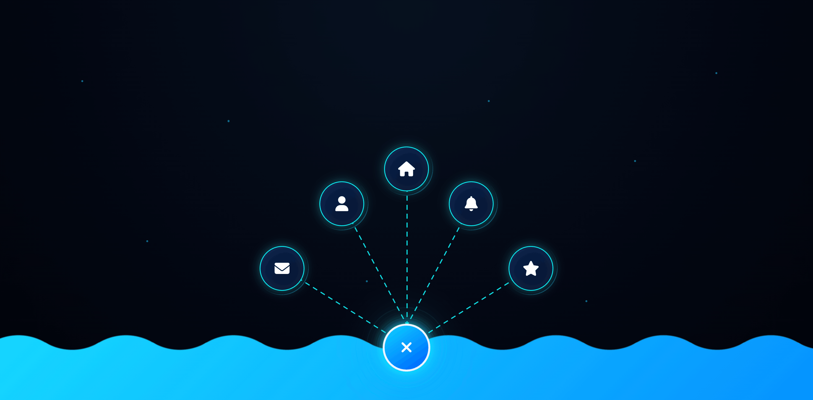

# liquid-wave-floating-menu

Modern futuristic floating navigation UI built using pure HTML, CSS and JavaScript.

---

## ✨ Features

- CSS Mask Wave Animation
- Floating Radial Menu
- Neon Glow Effects
- Animated Connector Lines
- Rotating Ring Effect
- Responsive Dark UI
- Smooth Open Animation
- Pure HTML CSS JS

---

## 🚀 Preview

Modern liquid-style bottom navigation with animated floating menu interaction.

---

## 🛠️ Technologies Used

- HTML5
- CSS3
- JavaScript

---

## 📂 Project Structure

/liquid-wave-floating-menu
│── index.html
│── style.css
│── script.js
│── thumbnail.png

---

## 💡 Inspiration

Inspired by futuristic dashboard interfaces and modern liquid UI trends.

---

## 📜 License

Free to use for learning and personal projects.
